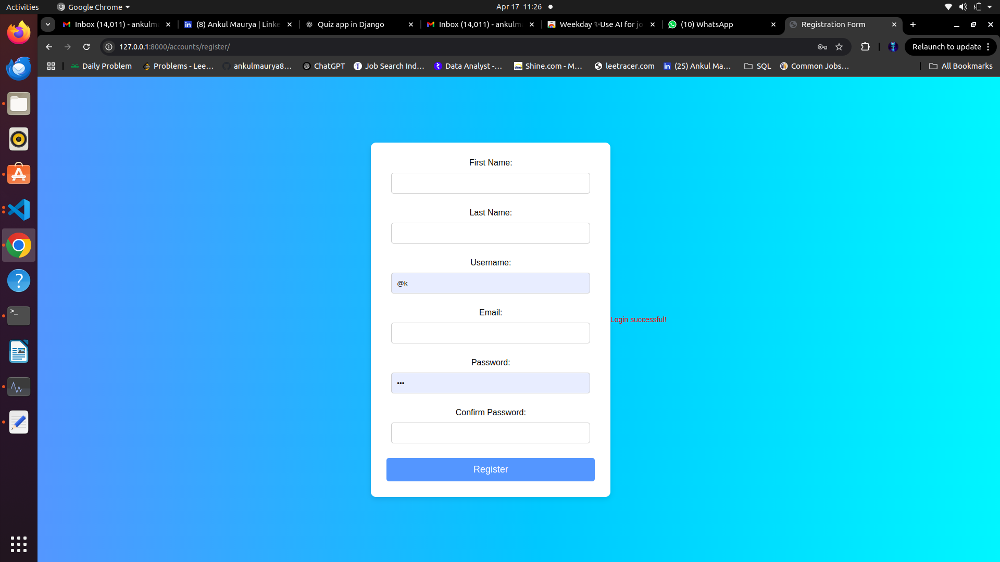
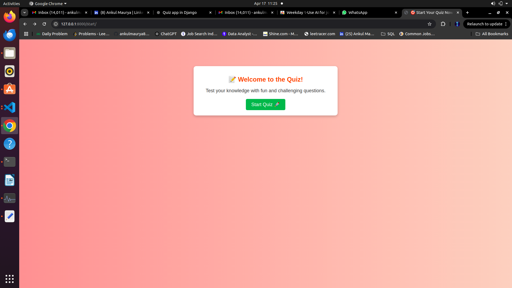
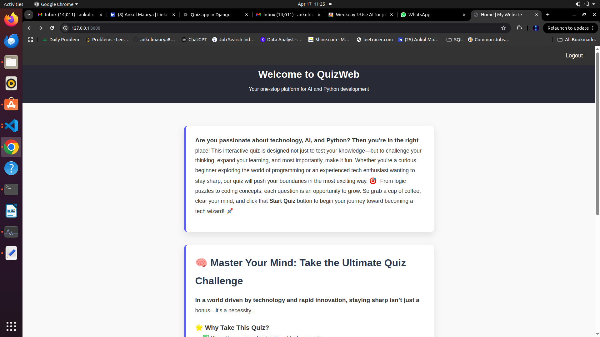
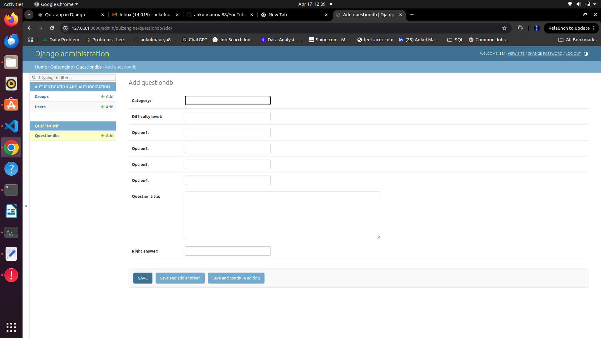

# 🧠 Django Quiz App

The **Django Quiz App** is a web-based quiz platform where users can take quizzes, track their scores, and review results. It features a clean UI, user authentication, and admin controls for quiz management. Built using Django and designed with Docker for easy deployment.

📌 **GitHub Repository**  
➡️ [https://github.com/ankulmaurya88/Django-Quiz-App.git](https://github.com/ankulmaurya88/Django-Quiz-App.git)

---

## 📌 Table of Contents

- [✨ Features](#-features)  
- [📸 Screenshots](#-screenshots)  
- [🧪 Input & Output](#-input--output)  
- [🧰 Technologies Used](#-technologies-used)  
- [📁 Project Structure](#-project-structure)  
- [⚙️ Installation Guide](#️-installation-guide)  
- [🐳 Docker Deployment](#-docker-deployment)  
- [🚀 Usage](#-usage)  
- [📄 License](#-license)  
- [👤 Author](#-author)  

---

## ✨ Features

✅ User Registration and Login  
✅ Multiple Quizzes with Timer and Scoring  
✅ Admin Panel for Quiz Management  
✅ Real-Time Score Tracking  
✅ Responsive and Minimal UI  
✅ Docker Support for Easy Deployment  

---

## 📸 Screenshots

### 🔹 Login Page  
User authentication for secure access.  


---

### 🔹 Quiz Interface  
Display questions one by one, timer-based interface.  


---

### 🔹 Score Page  
Results displayed after quiz completion with user score.  


### 🔹 Admin Page  
Display Admin Panel. 

---

## 🧪 Input & Output

### 📝 Input:
User logs in or signs up and selects a quiz to begin. Each quiz contains multiple-choice questions.

### 📤 Output:
After quiz submission, the user sees:

| Field         | Description                  |
|---------------|------------------------------|
| Quiz Title    | The name of the quiz taken   |
| User Score    | Total correct answers scored |
| Total Marks   | Total number of questions    |
| Time Taken    | Time spent on the quiz       |

---

## 🧰 Technologies Used

| Area        | Tools and Frameworks            |
|-------------|----------------------------------|
| Language     | Python 3.8+                     |
| Backend      | Django                          |
| Database     | SQLite (default), MySql         |
| Frontend     | HTML, CSS, Bootstrap            |
| Deployment   | Docker, Docker Compose          |
| Web Server   | Nginx (optional)                |

---

## 📁 Project Structure
Django-Quiz-App/ ├── manage.py ├── quiz/ # Main quiz app │ ├── admin.py │ ├── models.py │ ├── views.py │ ├── urls.py │ └── templates/ ├── users/ # User management ├── static/ # Static files ├── templates/ # Base templates ├── Dockerfile ├── docker-compose.yml └── requirements.txt

---

## ⚙️ Installation Guide

### 🔧 Prerequisites

- Python 3.8+
- Git
- Virtual Environment (optional but recommended)

### 🛠️ Steps

```bash
# Clone the repository
git clone https://github.com/ankulmaurya88/Django-Quiz-App.git
cd Django-Quiz-App

# (Optional) Create and activate a virtual environment
python3 -m venv venv
source venv/bin/activate  # Windows: venv\Scripts\activate

# Install Python dependencies
pip install -r requirements.txt

# Run migrations
python manage.py migrate

# Create a superuser for admin access
python manage.py createsuperuser

# Run the development server
python manage.py runserver
```
---

## 🐳 Docker Deployment

---
```bash
# Clone the repo
git clone https://github.com/ankulmaurya88/Django-Quiz-App.git
cd Django-Quiz-App

# Build and deploy with Docker Compose
docker-compose up --build
```
---
### 🚀 Usage
Open the app in your browser: http://localhost:8000

Register or login as a user

Choose a quiz and start answering questions

Submit the quiz and view your score
Admins can manage quizzes via the Django admin panel at http://localhost:8000/admin/

---
### 📄 License
This project is licensed under the MIT License – see the LICENSE file for details.


---
### 👤 Author
Ankul Maurya

GitHub: @ankulmaurya88

LinkedIn: linkedin.com/in/ankulmaurya


